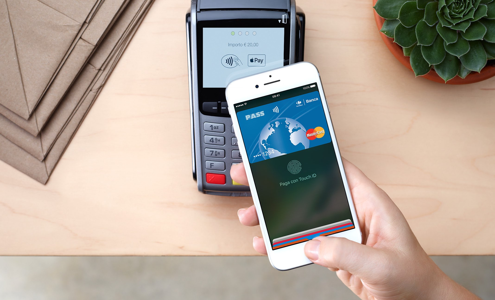

# Apple's Apple Pay

# Description

Apple Pay is an innovative cardless payment system that aims to provide a secure payment alternative.

# Contributors

- Cornelius
- Jonathan
- Marius
- Cindy
- Antonio
- Lynette
- David

# Apple's Apple Pay - An Analysis

## What Is It:

Apple Pay is arguably the leading mobile payment and digital wallet service. It allows users to make payments in person, in iOS apps, and on the web. It is supported on the iPhone, Apple Watch, iPad, and Mac.

## Why This Matters:

This is an important example of how a leading tech company is moving into consumer finance in a big way, using their existing iPhone/iPad/Mac platform and existing Apple Store relationships to gain market share. And Apple Pay is hugely successful: well over a ​billion ​Apple Pay transactions took place in the second quarter of 2018, and more mobile transactions took place that quarter using Apple Pay than PayPal.

Also notable are the reasons why Apple Pay is so successful; namely, that

- it seems to be more secure than a traditional credit card
- it is possible to store additional information that can be needed for certain transactions, such as driver’s license information to verify age when purchasing alcoholic beverages

## Why This May Be Interesting:

- One may likely use Apple Pay or a similar service, such as Google Pay
- Apple’s business strategy, most notably that of “letting first movers flail” is on view here
- The digital payments that Apple Pay supports is one of the core activities of fintech
- The growth of digital payment technologies will provide many employment opportunities, many of which are entry level (Search, for example, Indeed.com for “digital payment technologies”)

## Things to Keep in Mind for a Case Study:

- The basic business model of the credit card industry, including the importance of credit card fraud
- How the Apple Pay ecosystem works, both on the consumer side and on the merchant side
- A discussion of EMV tokens, a security measure used by Apple Pay

## Resources:

- [Wikipedia page about Apple Pay](https://en.wikipedia.org/wiki/Apple_Pay)
- [Wikipedia page about digital wallets](https://en.wikipedia.org/wiki/Digital_wallet​​)
- [a discussion of what’s wrong with current credit cards and how the EMV token, a security measure built into Apple Pay, work](https://kirklennon.com/a/applepay.html)
- [details on how the EMV token works, from the company that makes them](https://www.emvco.com/emv-technologies/payment-tokenisation/​)
